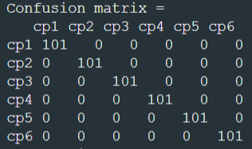

# Tietoliikenteen sovellus projecti R15

Tämä on koulu projekti, jossa kerätään kiihtyvyysanturin dataa ja lähetetään sitä bluetoothin yli nordic embedded laitteella. Seuraavaksi raspberry pi ottaa bluetooth signaalin kiinni ja tallentaa saadun datan tietokantaan. Tietokannan data tallennetaan csv tiedostoksi, jota käytetään algorytmiä laskeaksemme eri suuntien keskipisteet. Nyt kun keskipisteet ovat tiedossa käytämme niitä kiihtyvyysanturin koodissa, jotta tiedämme suoraan mihin suuntaan anturi osoittaa.

Confusion matriisi jolla näemme algorytmin tarkkuuden, testissämme se tuotti sadan prosentin osuvuuden.
Kolumit ovat algorytmin laskema suunta, joka otettu kiihtyvyys anturista ja rivit ovat käyttäjän kertomat suunnat.

